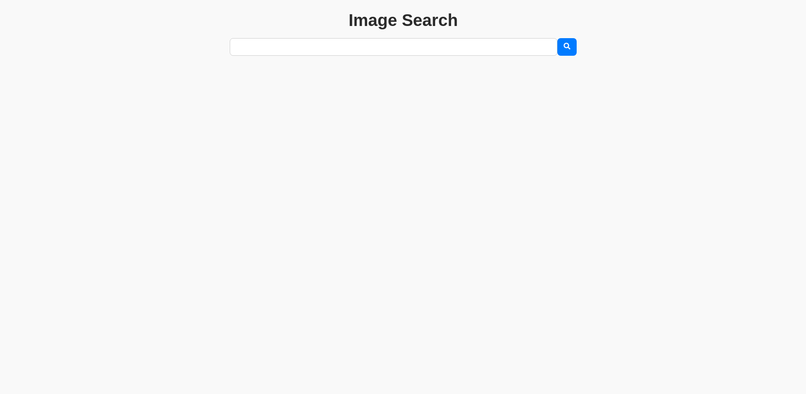

# AI Image Search

An image search full-stack web application using React and Vite for the frontend, Flask for the backend, MongoDB for storage, and CLIP embeddings for semantic search of queries and images.



## Getting Started

1. Clone this repository:

```bash
git clone https://github.com/QinWenFeng/ImageSearch-ReactVite-FlaskMongoDB-CLIP.git
cd ImageSearch-ReactVite-FlaskMongoDB-CLIP
```

2. Navigate to the backend directory:

```bash
cd backend
```

3. Create virtual environment:

```bash
# Ubuntu
python3 -m venv venv
```

4. Activate virtual environment:

```bash
# Ubuntu
source venv/bin/activate
```

5. Install the required dependencies:

```bash
pip install -r requirements.txt
```

6. Navigate to the frontend directory:

```bash
cd ../frontend
```

7. Install the required dependencies:

```bash
npm install
```

## Usage

1. Build the frontend:

```bash
npm run build
```

2. Navigate to the backend directory:

```bash
cd ../backend
```

3. Run the Flask app:

```bash
flask run
```

4. Open your web browser and navigate to http://localhost:5173 to access the web interface.


